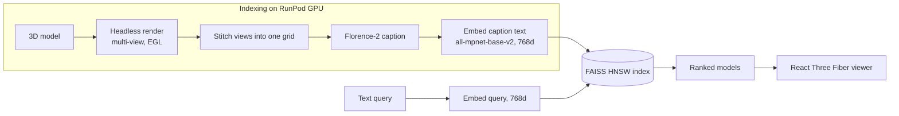

# 3DRAG

Search a library of 3D models with plain language. Type "wooden chair" or "armored knight" and get back matching GLBs you can spin around in the browser. Nothing embeds the geometry directly; each model is rendered, described, and searched as text.

## Why I built it

Retrieving 3D assets by keyword is painful. Most libraries only know whatever filename or tag someone happened to type. I wanted real semantic search over a big asset set (Objaverse) without training a 3D encoder or paying for one. 3DRAG takes a shortcut: it renders each model to an image, has a vision model describe it, and embeds that description. A text query then searches the same space. The whole thing turns cross-modal 3D retrieval into plain text-to-text similarity, cheap to index and query.

## What it does

- Natural-language search over indexed 3D models, ranked by cosine similarity
- Renders, captions, and embeds every model on a RunPod GPU worker
- Serves a React Three Fiber viewer that loads and auto-rotates the result GLB
- Processes models from a storage bucket, direct upload, or Objaverse UIDs
- Streams indexing progress to the UI over a WebSocket
- Ships an evaluation harness (queries, ground truth, MRR / Recall@k / NDCG)

## How it works

Two paths. Indexing is GPU-heavy and runs on RunPod. Search is light and runs on the CPU API host.



### Rendering and captioning on RunPod

The worker downloads a model with trimesh and renders several orthographic views headless with pyrender over EGL. pyrender's OpenGL contexts cannot be shared across threads, so rendering runs in a multiprocessing pool with pyrender imported inside each worker process. Before captioning, the views are stitched into one grid image, so the vision model sees front, side, back, and top in a single pass at a fraction of the tokens. Florence-2 captions the grid, and that caption is what gets embedded.

### FAISS HNSW

The index is a FAISS `IndexHNSWFlat` (M=32, efConstruction=40, efSearch=64). HNSW needs no training and takes new vectors one at a time. It has no true delete, so removing a model rebuilds the graph. Adds stay cheap. It returns L2 distances, converted to a cosine score with `1 - L2^2 / 2` for normalized vectors.

### The GPU / CPU split

RunPod handles everything expensive (download, render, caption, embed) as a serverless job that scales to zero between batches. The API splits a batch across idle workers so they run concurrently. The always-on FastAPI host does the light work: it holds the FAISS index, embeds queries on CPU, serves preview images, and streams progress over a WebSocket. For big batches it uploads models to the bucket first and passes RunPod a URL.

## Secondary highlights

**Resume-safe bulk indexing.** Indexing a whole bucket can fail partway through a long run, so `/storage/process` can pick up where it left off. It reads the URLs already in the index, skips any candidate that matches, and processes only the remainder. A crashed 5000-model job restarts and finishes just the models still missing. A separate strict mode clears the index and rebuilds from scratch when you want a clean slate.

## Tech stack

- Frontend: React 19, Vite, React Three Fiber (@react-three/fiber, drei), three.js, TypeScript, Tailwind v4
- API: FastAPI, Uvicorn, FAISS (faiss-cpu, HNSW), sentence-transformers, WebSockets, boto3
- GPU worker (RunPod serverless): trimesh + pyrender + EGL rendering, Florence-2 captioning, sentence-transformers on CUDA
- Storage: DigitalOcean Spaces (S3-compatible)
- Data: Objaverse-XL and Objaverse-LVIS (GLB and other mesh formats)
- Infra: Railway (API), Vercel (viewer)

## Repo layout

```
3DRAG/
  main.py              FastAPI app: search, upload, batch, dataset, WebSocket
  faiss_index.py       thread-safe HNSW index + metadata store
  runpod_client.py     calls the RunPod worker (render + caption + embed)
  ollama_client.py     alternate local/Ollama vision + embedding path
  storage.py           DigitalOcean Spaces client
  dataset_generator.py Objaverse download + index generation
  local_renderer.py    local render fallback
  runpod/
    handler.py         RunPod serverless entrypoint
    modules/           renderer, captioner, embedder, downloader
  frontend/            Vite + React Three Fiber viewer
  eval/                500-model benchmark, queries, ground truth, metrics
```

## Running it

```bash
# API
pip install -r requirements.txt
cp .env.example .env         # RunPod + DigitalOcean Spaces keys
uvicorn main:app --reload    # http://localhost:8000

# viewer
cd frontend && npm install && npm run dev
```

Key endpoints: `GET /search?q=...&k=10`, `POST /storage/process` (index a bucket folder), `POST /models` (upload one), `POST /models/batch`, `POST /dataset/generate` (from Objaverse), `GET /models`, and `WS /ws` for live progress. Supported formats: glb, gltf, obj, stl, ply, fbx, dae, 3ds.

## Evaluation

`eval/` holds a labeled retrieval benchmark: 500 Objaverse-LVIS models across 50 categories, 50 realistic queries, and auto-generated ground truth. `evaluate.py` queries the API and reports MRR, Recall@1/5/10, NDCG@10, and Precision@5 with a per-category breakdown, so I can measure whether a prompt or embedding change actually helped.

## Status

Working prototype. Retrieval is only as good as the captions the vision model produces. The eval harness measures exactly that.
