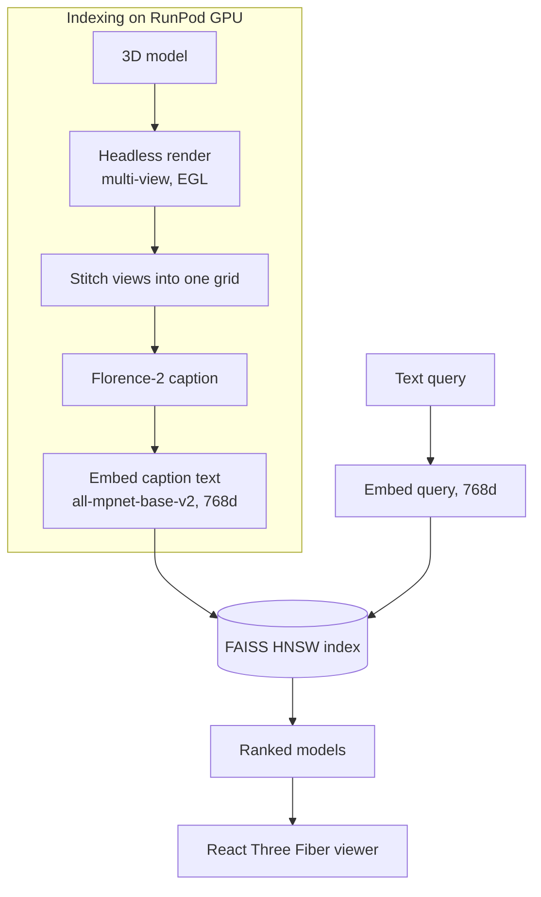

# 3DRAG

Search a library of 3D models with plain language. Type "wooden chair" or "armored knight" and get back matching GLBs you can spin around in the browser. The catch is that nothing embeds the geometry directly. Each model is rendered, described, and searched as text.

## Why I built it

Retrieving 3D assets by keyword is painful because most libraries only have whatever filename or tag someone typed. I wanted semantic search over a real asset set (Objaverse) without training a 3D encoder or paying for one. So instead of embedding meshes, 3DRAG turns each model into a rendered picture, has a vision model describe it, and embeds that description. A text query then searches the same space. It collapses cross-modal 3D retrieval into text-to-text similarity, which is cheap and works well enough to be useful.

## What it does

- Natural-language search over indexed 3D models, ranked by cosine similarity
- Renders, captions, and embeds every model on a RunPod GPU worker
- Serves a React Three Fiber viewer that loads and auto-rotates the result GLB
- Processes models from a storage bucket, direct upload, or Objaverse UIDs
- Streams indexing progress to the UI over a WebSocket
- Ships an evaluation harness (queries, ground truth, MRR / Recall@k / NDCG)

## How it works

Two paths. Indexing is GPU-heavy and runs on RunPod. Search is light and runs on the CPU API host.



### Rendering and captioning on RunPod

The worker downloads a model with trimesh, then renders several orthographic views headless with pyrender over EGL. Because pyrender uses OpenGL contexts that cannot be shared across threads, rendering runs in a multiprocessing pool with pyrender imported inside each worker process, not at module load. The views are then stitched into a single grid image before captioning, so the vision model sees front, side, back, and top in one pass and spends a fraction of the vision tokens it would on four separate images. Florence-2 captions the grid, and the caption is what gets embedded.

### The text bottleneck

Geometry never becomes a vector. The rendered views produce a caption, `all-mpnet-base-v2` embeds that caption into 768 dimensions, and that is what lives in the index. A search query is embedded by the same model, so matching a query to a model is just text-to-text cosine similarity. The trade is real: a caption throws away fine geometric detail and depends on the vision model naming the object well. In exchange the whole index is one plain text-embedding space, queries embed on CPU in milliseconds, and there is no 3D encoder to train or serve. (An alternate path can embed 1152-dim SigLIP2 image features instead; the default is the 768-dim text route.)

### FAISS HNSW, and why deletes rebuild

The index is a FAISS `IndexHNSWFlat` (M=32, efConstruction=40, efSearch=64). HNSW needs no training and takes new vectors one at a time, which fits a dataset that grows as you index more models. The cost shows up on deletion: HNSW has no real remove, so taking one model out reconstructs every vector and rebuilds the graph from scratch. That is O(n) and fine at this scale, but it is the reason the index is append-friendly and delete-expensive. HNSW returns L2 distances, converted to a cosine similarity score with `1 - L2^2 / 2` for normalized vectors.

### The GPU / CPU split

RunPod does everything expensive (download, render, caption, embed) as a serverless job that scales to zero between batches, and the API splits a batch across idle workers concurrently. The always-on FastAPI host stays cheap: it holds the FAISS index, embeds queries on CPU, serves preview images, and streams progress over a WebSocket. Uploading to the storage bucket first and sending RunPod a URL instead of raw bytes keeps the request payloads small on large batches.

## Tech stack

- Frontend: React 19, Vite, React Three Fiber (@react-three/fiber, drei), three.js, TypeScript, Tailwind v4
- API: FastAPI, Uvicorn, FAISS (faiss-cpu, HNSW), sentence-transformers, WebSockets, boto3
- GPU worker (RunPod serverless): trimesh + pyrender + EGL rendering, Florence-2 captioning, sentence-transformers on CUDA
- Storage: DigitalOcean Spaces (S3-compatible)
- Data: Objaverse-XL and Objaverse-LVIS (GLB and other mesh formats)
- Infra: Railway (API), Vercel (viewer)

## Repo layout

```
3DRAG/
  main.py              FastAPI app: search, upload, batch, dataset, WebSocket
  faiss_index.py       thread-safe HNSW index + metadata store
  runpod_client.py     calls the RunPod worker (render + caption + embed)
  ollama_client.py     alternate local/Ollama vision + embedding path
  storage.py           DigitalOcean Spaces client
  dataset_generator.py Objaverse download + index generation
  local_renderer.py    local render fallback
  runpod/
    handler.py         RunPod serverless entrypoint
    modules/           renderer, captioner, embedder, downloader
  frontend/            Vite + React Three Fiber viewer
  eval/                500-model benchmark, queries, ground truth, metrics
```

## Running it

```bash
# API
pip install -r requirements.txt
cp .env.example .env         # RunPod + DigitalOcean Spaces keys
uvicorn main:app --reload    # http://localhost:8000

# viewer
cd frontend && npm install && npm run dev
```

Key endpoints: `GET /search?q=...&k=10`, `POST /storage/process` (index a bucket folder), `POST /models` (upload one), `POST /models/batch`, `POST /dataset/generate` (from Objaverse), `GET /models`, and `WS /ws` for live progress. Supported formats: glb, gltf, obj, stl, ply, fbx, dae, 3ds.

## Evaluation

`eval/` holds a labeled retrieval benchmark: 500 Objaverse-LVIS models across 50 categories, 50 realistic queries, and auto-generated ground truth. `evaluate.py` queries the API and reports MRR, Recall@1/5/10, NDCG@10, and Precision@5 with a per-category breakdown, so I can measure whether a prompt or embedding change actually helped.

## Status

Working prototype. The text-bottleneck approach is the interesting part and the main limitation: retrieval is only as good as the captions, so it trades geometric precision for a cheap, trainable-free pipeline. The eval harness exists to keep that tradeoff honest.
